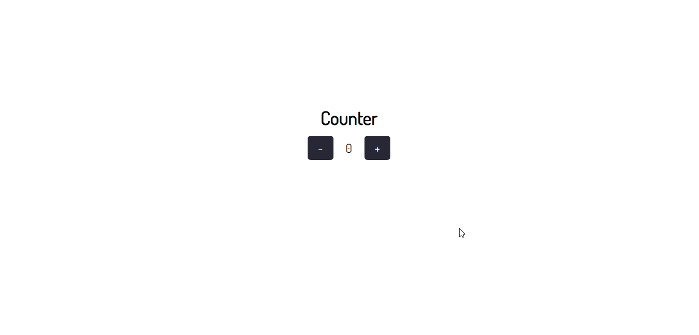
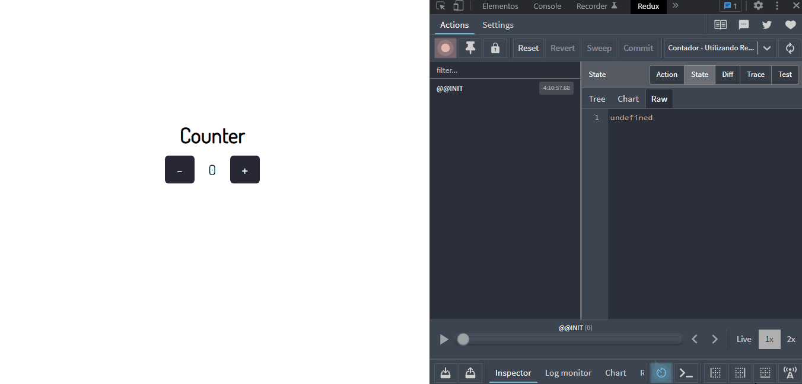

# Contador Simples

Projeto apenas de aprendizado, criado para praticar implementação dos conceitos de estado de componentes e integração com React template TypeScript utilizando Redux.

## Tecnologias Utilizadas

## Demontração

### Aplicação

### Ferramenta (ReduxDevTools)
